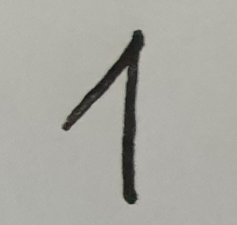
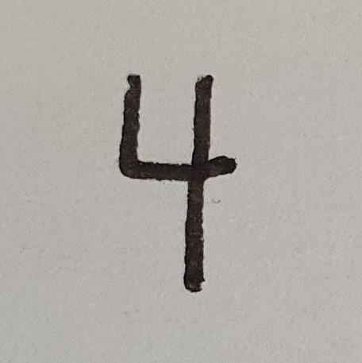
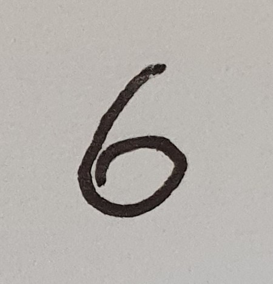
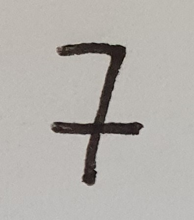
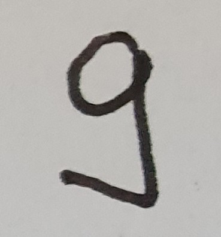

# ImageProcessing

Contains multiple examples on how images can be processed using C# .NET.

## Recognize Numbers by Signature

### Overview

In the first example we will try to identify numbers (0-9) in an image by using their signature.

These are the images with the numbers in their unprocessed from.

 1  |  2  |  3  |  4  |  5
--- | --- | --- | --- | ---
 |  |  |  | 

 6  |  7  |  8  |  9  |  0
--- | --- | --- | --- | ---
 |  |  |  | 

By applying different processing steps, we try to get the signature of the number displayed
in the image. The reason we want the signature is:

* It provides a stable result even if the number in the image is rotated.
* It can be scaled to a normalized graph, so that the scale of the number in the image can be neglected.


### Step 1: converting the image to a binary image

An image is represented by a matrix containing its color as a RGB (red, green, blue) value. We can convert
those pixels by applying a given threashold `t` to their color values. Is the average color value of a pixel
belove the threashold `t`, then we convert this pixel to black (represented by 1) otherwise to white
(represented by 0). By doing so we get a simpler matrix, which is more suitable for futher image processing.

```
 Threashold t: 120
 Color value of a pixel: (R + G + B)/3

 Conversion: ColorValueOfAPixel > t   --->   true: 0;  false: 1

 RGB image in hex values                          Binary image
 [ 0xFFFFFF 0x000000 0xFFFFFF 0xFFFFFF ]          [ 0 1 0 0 ]
 [ 0xFFFFFF 0x000000 0x000000 0xFFFFFF ]          [ 0 1 1 0 ]
 [ 0xFFFFFF 0x000000 0x111111 0x222222 ]   --->   [ 0 1 1 1 ]
 [ 0xFFFFFF 0x000000 0x000000 0xFFFFFF ]          [ 0 1 1 0 ]
 [ 0xFFFFFF 0xFFFFFF 0xFFFFFF 0xFFFFFF ]          [ 0 0 0 0 ]
```

original (color) | . | converted (binary)
---------------- | - | ------------------
 | => | 


### Application

And this is the result in the sample application (screen shot).


## Remarks

### Image Icon

The Image Icon was taken from [iconfinder.com](https://www.iconfinder.com/icons/79825/compressed_image_svg+xml_icon).


Author:  [Frank Souza](https://www.iconfinder.com/iconsets/fs-icons-ubuntu-by-franksouza-)  
Licence: Free for non commercial use