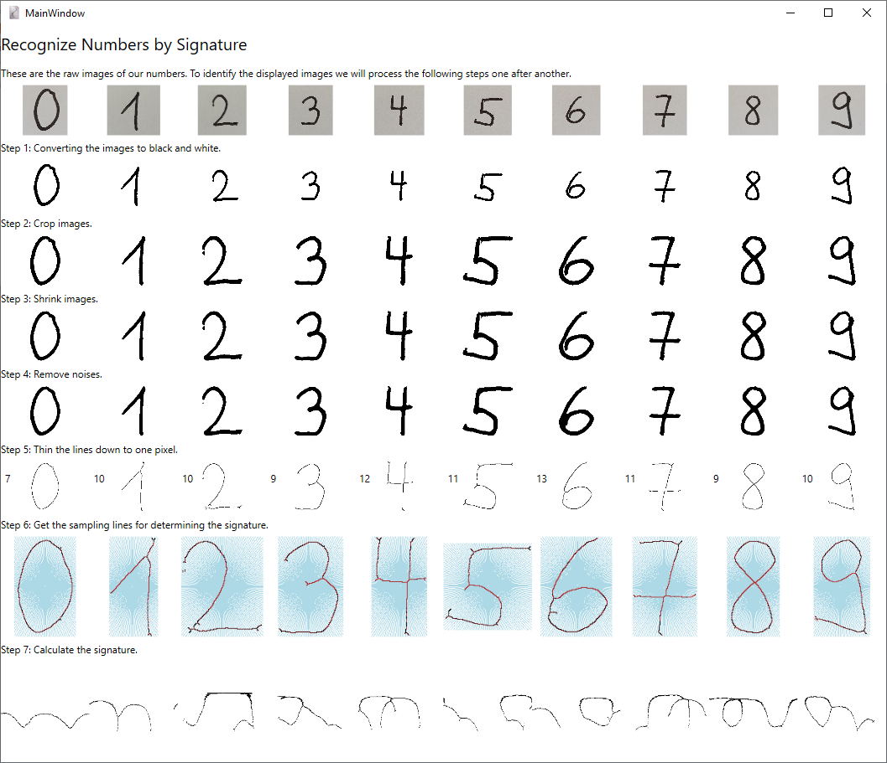

# ImageProcessing

Contains multiple examples on how images can be processed using C# .NET.

## Recognize Numbers by Signature

In the first example we will identify numbers (0-9) in an image by using 
their signature.

These are the images with the numbers in their unprocessed from.

 1  |  2  |  3  |  4  |  5
--- | --- | --- | --- | ---
 |  |  |  | 

 6  |  7  |  8  |  9  |  0
--- | --- | --- | --- | ---
 |  |  |  | 

After applying different processing steps this is the result so far.

## Remarks

### Image Icon

The Image Icon was taken from [iconfinder.com](https://www.iconfinder.com/icons/79825/compressed_image_svg+xml_icon).

Author:  [Frank Souza](https://www.iconfinder.com/iconsets/fs-icons-ubuntu-by-franksouza-)  
Licence: Free for non commercial use