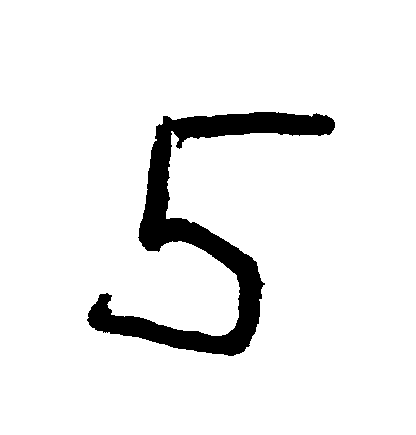

# ImageProcessing

Contains multiple examples on how images can be processed using C# .NET.

## Recognize Numbers by Signature

### Overview

The goal is to identify numbers (0-9) in an image by using their signature.

These are the images with the numbers in their unprocessed from.

 1  |  2  |  3  |  4  |  5
--- | --- | --- | --- | ---
 |  |  |  | 

 6  |  7  |  8  |  9  |  0
--- | --- | --- | --- | ---
 |  |  |  | 

By applying different processing steps, we try to get the signature of the number displayed
in the image. The reason we want the signature is:

* It provides a stable result even if the number in the image is rotated.
* It can be scaled to a normalized graph, so that the scale of the number in the image can be neglected.

### Processing Steps

A more detailed explanation of the processing steps can be found [here](https://github.com/mmarkovic/ImageProcessing/tree/main/doc#readme).

The following steps will be performed to get the signature of the number in an image.

  0  |  1.  |  2.  |  3.  |  4.  |  5.  |  6. 
---- | ---- | ---- | ---- | ---- | ---- | ----
 |  |  |  |  |  | 
original | binary image convertion | corpping | shrinking | smoothing | skeleton extraction | signature calculation

### UI

The calculated signature will be displayed in the UI as well as the maching signature template.

## Remarks

### Image Icon

The Image Icon was taken from [iconfinder.com](https://www.iconfinder.com/icons/79825/compressed_image_svg+xml_icon).

Author:  [Frank Souza](https://www.iconfinder.com/iconsets/fs-icons-ubuntu-by-franksouza-)  
Licence: Free for non commercial use