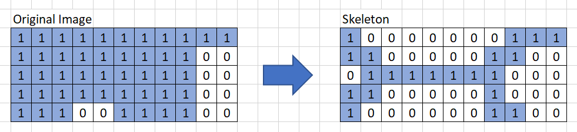
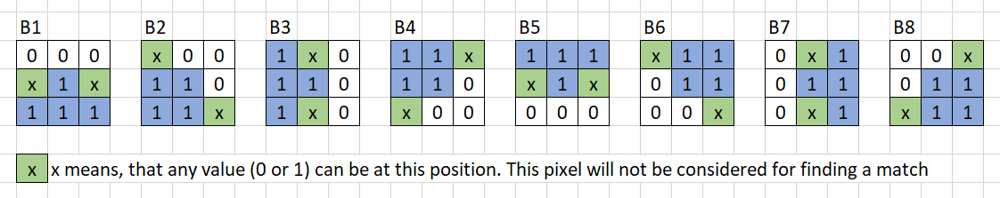
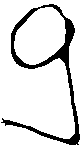
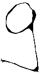
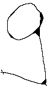
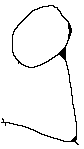
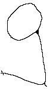
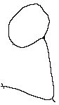
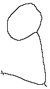

# Thinning

Thinning describes the process of reducing the shapes in an images to its core skeleton.
By applying thinning to a shape only its characteristic attributes remain, which can be
used for futher processing steps such as object recognition.

The starting point in this project is a binary image with a broad area. To get the skeleton
of this area, structural elements will be applied using the hit-and-miss transformation.
Here we are using the strucutral elements B1 to B8.

This is the result of applying the structural elements in sequence through 10 iterations.

A step by step description can be found in the following excel sheet:
[ThinningTestCases.xlsx](./ThinningTestCases.xlsx)